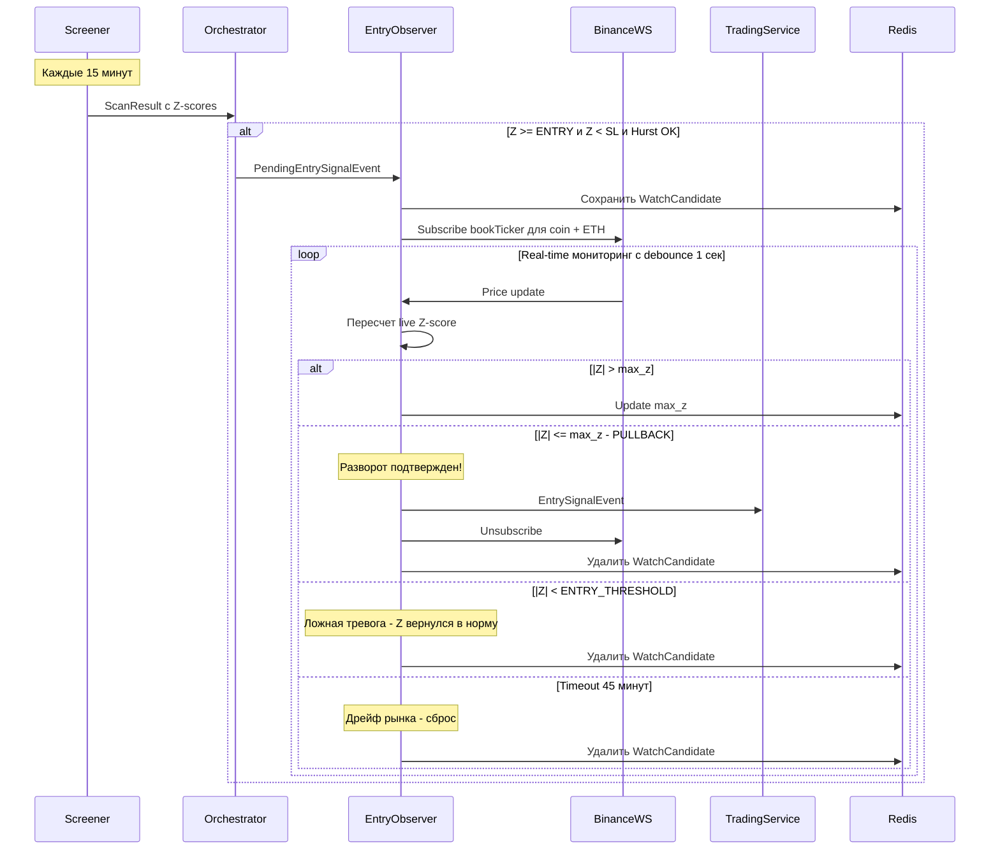
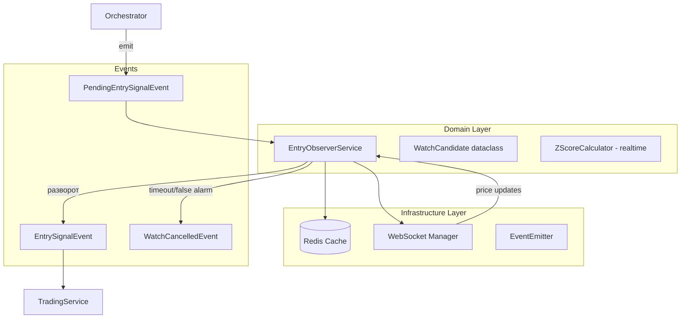

# Trailing Entry Observer - План реализации

## 1. Проблема

**Текущее поведение:** Бот входит в сделку сразу при пробитии `Z_ENTRY_THRESHOLD` (2.1).

**Проблема:** Возможен "прострел" - Z-score может продолжить движение (2.1 → 2.5 → 3.0 → 3.5), и вход на 2.1 приведет к немедленному минусу.

**Решение:** Trailing Entry - вход только после подтверждения разворота:
1. Z-score пробивает порог → начинаем мониторинг
2. Отслеживаем максимум |Z|
3. Входим только при откате от максимума на PULLBACK пунктов

## 2. Архитектура решения

### 2.1 Новый поток событий



### 2.2 Структура компонентов



## 3. Детальный план реализации

### 3.1 Новые события в events.py

```python
# Новые типы событий
class EventType(str, Enum):
    # ... существующие ...
    PENDING_ENTRY_SIGNAL = pending_entry_signal  # Кандидат на вход, начало мониторинга
    WATCH_CANCELLED = watch_cancelled           # Мониторинг отменен без входа

@dataclass
class PendingEntrySignalEvent(BaseEvent):
    '''
    Событие для начала мониторинга кандидата на вход.
    Содержит все данные как EntrySignalEvent + статистика spread для расчета live Z-score.
    '''
    event_type: EventType = field(default=EventType.PENDING_ENTRY_SIGNAL, init=False)

    # Symbol info
    coin_symbol: str = ''
    primary_symbol: str = ''
    spread_side: SpreadSide = SpreadSide.LONG

    # Signal metrics at detection time
    z_score: float = 0.0
    beta: float = 0.0
    correlation: float = 0.0
    hurst: float = 0.0

    # Current prices
    coin_price: float = 0.0
    primary_price: float = 0.0

    # Spread statistics для live Z-score расчета
    spread_mean: float = 0.0    # Rolling mean of spread
    spread_std: float = 0.0     # Rolling std of spread

    # Thresholds
    z_entry_threshold: float = 2.0
    z_tp_threshold: float = 0.0
    z_sl_threshold: float = 4.5


@dataclass
class WatchCancelledEvent(BaseEvent):
    '''Мониторинг отменен без входа'''
    event_type: EventType = field(default=EventType.WATCH_CANCELLED, init=False)

    coin_symbol: str = ''
    reason: str = ''  # timeout, false_alarm, sl_hit
    max_z_reached: float = 0.0
    final_z: float = 0.0
    watch_duration_seconds: float = 0.0
```

### 3.2 WatchCandidate модель

```python
@dataclass
class WatchCandidate:
    '''Состояние мониторинга кандидата на вход'''

    coin_symbol: str
    primary_symbol: str
    spread_side: SpreadSide

    # Tracking
    status: str = 'WATCHING'  # WATCHING, ENTERED, CANCELLED
    max_z: float = 0.0        # Максимальный достигнутый |Z|

    # Spread statistics for live calculation
    beta: float = 0.0
    spread_mean: float = 0.0
    spread_std: float = 0.0

    # Original signal data
    correlation: float = 0.0
    hurst: float = 0.0
    z_tp_threshold: float = 0.0
    z_sl_threshold: float = 0.0

    # Timing
    created_at: datetime = field(default_factory=lambda: datetime.now(timezone.utc))

    # Live prices - обновляются через WebSocket
    coin_price: float = 0.0
    primary_price: float = 0.0

    @property
    def current_spread(self) -> float:
        '''Текущий spread: log(coin) - beta * log(primary)'''
        if self.coin_price <= 0 or self.primary_price <= 0:
            return 0.0
        import math
        return math.log(self.coin_price) - self.beta * math.log(self.primary_price)

    @property
    def current_z_score(self) -> float:
        '''Текущий Z-score в реальном времени'''
        if self.spread_std == 0:
            return 0.0
        return (self.current_spread - self.spread_mean) / self.spread_std

    @property
    def watch_duration_seconds(self) -> float:
        '''Время мониторинга в секундах'''
        return (datetime.now(timezone.utc) - self.created_at).total_seconds()
```

### 3.3 EntryObserverService

```python
class EntryObserverService:
    '''
    Сервис мониторинга кандидатов на вход с Trailing Entry логикой.

    Логика:
    1. Получает PendingEntrySignalEvent от Orchestrator
    2. Создает WatchCandidate и подписывается на live prices через WebSocket
    3. Каждую секунду пересчитывает Z-score
    4. Входит при откате от максимума на PULLBACK пунктов
    5. Отменяет при таймауте (45 мин) или возврате Z в норму
    '''

    PULLBACK = 0.3                    # Откат в пунктах Z-score для входа
    WATCH_TIMEOUT_SECONDS = 45 * 60   # 45 минут
    DEBOUNCE_SECONDS = 1.0            # Частота проверок

    def __init__(
        self,
        event_emitter: EventEmitter,
        exchange_client: BinanceClient,
        redis_cache: RedisCache,
        logger,
        z_entry_threshold: float = 2.0,
        z_sl_threshold: float = 4.5,
        pullback: float = 0.3,
        watch_timeout_seconds: int = 2700,  # 45 min
    ):
        self._emitter = event_emitter
        self._exchange = exchange_client
        self._redis = redis_cache
        self._logger = logger
        self._z_entry = z_entry_threshold
        self._z_sl = z_sl_threshold
        self._pullback = pullback
        self._timeout = watch_timeout_seconds

        # Active watches: coin_symbol -> WatchCandidate
        self._watches: Dict[str, WatchCandidate] = {}

        # WebSocket tasks: coin_symbol -> asyncio.Task
        self._ws_tasks: Dict[str, asyncio.Task] = {}

        # Shared primary price (ETH always needed)
        self._primary_price: float = 0.0
        self._primary_ws_task: Optional[asyncio.Task] = None

        # Debounce control
        self._last_check: Dict[str, float] = {}

        self._is_running = False
```

### 3.4 Формула расчета live Z-score

```python
def calculate_live_z_score(
    coin_price: float,
    primary_price: float,
    beta: float,
    spread_mean: float,
    spread_std: float,
) -> float:
    '''
    Расчет Z-score в реальном времени.

    Формула:
        spread = log(coin_price) - beta * log(primary_price)
        z_score = (spread - spread_mean) / spread_std

    spread_mean и spread_std берутся из последнего screener scan
    и остаются фиксированными на время мониторинга.
    '''
    import math

    if coin_price <= 0 or primary_price <= 0 or spread_std == 0:
        return 0.0

    current_spread = math.log(coin_price) - beta * math.log(primary_price)
    z_score = (current_spread - spread_mean) / spread_std

    return z_score
```

### 3.5 Модификация Orchestrator

```python
# В orchestrator.py, метод _check_entry_conditions

async def _check_entry_conditions(self, ...) -> List[PendingEntrySignalEvent]:
    '''
    Вместо EntrySignalEvent теперь emit PendingEntrySignalEvent.
    EntryObserver подхватит и начнет мониторинг.
    '''
    pending_signals = []

    for symbol, result in filtered_results.items():
        z = result.current_z_score

        if np.isnan(z):
            continue

        # Check entry condition
        if not (abs(z) >= z_entry and abs(z) < z_sl):
            continue

        # ... existing checks ...

        # Get spread statistics for live Z calculation
        spread_mean = result.spread_series.rolling(window=self._lookback).mean().iloc[-1]
        spread_std = result.spread_series.rolling(window=self._lookback).std().iloc[-1]

        event = PendingEntrySignalEvent(
            coin_symbol=symbol,
            primary_symbol=self._primary_pair,
            spread_side=SpreadSide.LONG if z < 0 else SpreadSide.SHORT,
            z_score=z,
            beta=result.current_beta,
            correlation=result.current_correlation,
            hurst=hurst_values.get(symbol, 0.0),
            coin_price=coin_price,
            primary_price=primary_price,
            spread_mean=spread_mean,
            spread_std=spread_std,
            z_entry_threshold=z_entry,
            z_tp_threshold=z_tp,
            z_sl_threshold=z_sl,
        )

        await self._event_emitter.emit(event)
        pending_signals.append(event)
```

### 3.6 Конфигурация (.env и settings.py)

```bash
# .env additions
TRAILING_ENTRY_PULLBACK=0.3        # Откат для подтверждения входа
TRAILING_ENTRY_TIMEOUT_MINUTES=45  # Таймаут мониторинга
```

```python
# settings.py additions
TRAILING_ENTRY_PULLBACK: float = 0.3
TRAILING_ENTRY_TIMEOUT_MINUTES: int = 45
```

### 3.7 Redis структура для состояния

```python
# Key format: watch_candidate:{coin_symbol}
# TTL: WATCH_TIMEOUT_SECONDS + buffer (60 sec)

# Example stored data:
{
    'coin_symbol': 'ARB/USDT:USDT',
    'primary_symbol': 'ETH/USDT:USDT',
    'spread_side': 'short',
    'status': 'WATCHING',
    'max_z': 2.45,
    'beta': 1.23,
    'spread_mean': 0.0234,
    'spread_std': 0.0012,
    'correlation': 0.89,
    'hurst': 0.42,
    'z_tp_threshold': 0.25,
    'z_sl_threshold': 4.0,
    'created_at': '2025-12-20T14:30:00Z',
    'coin_price': 1.234,
    'primary_price': 3456.78,
}
```

## 4. Основной алгоритм EntryObserverService

```python
async def _on_pending_signal(self, event: PendingEntrySignalEvent):
    '''Handler для PendingEntrySignalEvent'''
    coin = event.coin_symbol

    # Проверяем, не мониторим ли уже эту монету
    if coin in self._watches:
        self._logger.debug(f'Already watching {coin}, skipping')
        return

    # Создаем WatchCandidate
    watch = WatchCandidate(
        coin_symbol=coin,
        primary_symbol=event.primary_symbol,
        spread_side=event.spread_side,
        max_z=abs(event.z_score),
        beta=event.beta,
        spread_mean=event.spread_mean,
        spread_std=event.spread_std,
        correlation=event.correlation,
        hurst=event.hurst,
        z_tp_threshold=event.z_tp_threshold,
        z_sl_threshold=event.z_sl_threshold,
        coin_price=event.coin_price,
        primary_price=event.primary_price,
    )

    self._watches[coin] = watch

    # Сохраняем в Redis
    await self._save_watch_to_redis(watch)

    # Подписываемся на WebSocket для coin
    await self._subscribe_coin(coin)

    # Подписываемся на primary если еще не подписаны
    if self._primary_ws_task is None:
        await self._subscribe_primary()

    self._logger.info(
        f'👀 Started watching {coin} | '
        f'Z={event.z_score:.2f} | max_z={watch.max_z:.2f} | '
        f'side={event.spread_side.value}'
    )


async def _process_price_update(self, coin: str):
    '''Обработка обновления цены с debounce'''
    now = time.time()

    # Debounce - проверяем не чаще раза в секунду
    if coin in self._last_check:
        if now - self._last_check[coin] < self.DEBOUNCE_SECONDS:
            return

    self._last_check[coin] = now

    watch = self._watches.get(coin)
    if not watch:
        return

    # Рассчитываем текущий Z-score
    live_z = watch.current_z_score
    abs_z = abs(live_z)

    # 1. Проверяем таймаут
    if watch.watch_duration_seconds > self._timeout:
        await self._cancel_watch(coin, 'timeout', live_z)
        return

    # 2. Z вернулся в норму без входа - ложная тревога
    if abs_z < self._z_entry:
        await self._cancel_watch(coin, 'false_alarm', live_z)
        return

    # 3. Z пробил SL - не входим, отменяем
    if abs_z >= self._z_sl:
        await self._cancel_watch(coin, 'sl_hit', live_z)
        return

    # 4. Spread продолжает расширяться - обновляем max
    if abs_z > watch.max_z:
        watch.max_z = abs_z
        await self._save_watch_to_redis(watch)
        self._logger.debug(f'📈 {coin} new peak Z: {abs_z:.2f}')
        return

    # 5. Spread начал схлопываться - ПРОВЕРКА РАЗВОРОТА
    if abs_z <= watch.max_z - self._pullback:
        self._logger.info(
            f'✅ {coin} reversal confirmed! '
            f'Peak: {watch.max_z:.2f}, Current: {abs_z:.2f}'
        )
        await self._execute_entry(watch, live_z)


async def _execute_entry(self, watch: WatchCandidate, current_z: float):
    '''Подтвержденный вход - emit EntrySignalEvent'''

    # Создаем EntrySignalEvent для TradingService
    event = EntrySignalEvent(
        coin_symbol=watch.coin_symbol,
        primary_symbol=watch.primary_symbol,
        spread_side=watch.spread_side,
        z_score=current_z,
        beta=watch.beta,
        correlation=watch.correlation,
        hurst=watch.hurst,
        coin_price=watch.coin_price,
        primary_price=watch.primary_price,
        z_tp_threshold=watch.z_tp_threshold,
        z_sl_threshold=watch.z_sl_threshold,
    )

    # Отправляем событие
    await self._emitter.emit(event)

    # Cleanup
    await self._cleanup_watch(watch.coin_symbol)

    self._logger.info(
        f'🎯 Entry executed | {watch.coin_symbol} | '
        f'Z={current_z:.2f} | peak was {watch.max_z:.2f}'
    )
```

## 5. WebSocket управление

```python
async def _subscribe_coin(self, coin: str):
    '''Подписка на book ticker для coin'''

    async def on_update(data: Dict):
        '''Callback при обновлении цены'''
        watch = self._watches.get(coin)
        if watch:
            watch.coin_price = data['bid_price']  # mid price
            await self._process_price_update(coin)

    task = await self._exchange.subscribe_book_ticker(coin, on_update)
    self._ws_tasks[coin] = task


async def _subscribe_primary(self):
    '''Подписка на ETH/USDT:USDT - shared для всех watches'''

    async def on_primary_update(data: Dict):
        '''Callback при обновлении цены ETH'''
        self._primary_price = data['bid_price']

        # Обновляем primary_price во всех watches
        for watch in self._watches.values():
            watch.primary_price = self._primary_price

    self._primary_ws_task = await self._exchange.subscribe_book_ticker(
        self._primary_symbol, on_primary_update
    )


async def _cleanup_watch(self, coin: str):
    '''Cleanup после входа или отмены'''

    # Отменяем WebSocket task для coin
    if coin in self._ws_tasks:
        self._ws_tasks[coin].cancel()
        del self._ws_tasks[coin]

    # Удаляем из локального состояния
    if coin in self._watches:
        del self._watches[coin]

    if coin in self._last_check:
        del self._last_check[coin]

    # Удаляем из Redis
    await self._redis.delete(f'watch_candidate:{coin}')

    # Если больше нет watches - отписываемся от primary
    if not self._watches and self._primary_ws_task:
        self._primary_ws_task.cancel()
        self._primary_ws_task = None
```

## 6. Container интеграция

```python
# container.py additions

@property
def entry_observer_service(self):
    '''Get Entry Observer Service for trailing entry logic.'''
    self._check_initialized()
    if 'entry_observer_service' not in self._instances:
        from src.domain.entry_observer import EntryObserverService

        self._instances['entry_observer_service'] = EntryObserverService(
            event_emitter=self.event_emitter,
            exchange_client=self.exchange_client,
            redis_cache=self.redis_cache,
            logger=self.logger,
            z_entry_threshold=self._settings.Z_ENTRY_THRESHOLD,
            z_sl_threshold=self._settings.Z_SL_THRESHOLD,
            pullback=self._settings.TRAILING_ENTRY_PULLBACK,
            watch_timeout_seconds=self._settings.TRAILING_ENTRY_TIMEOUT_MINUTES * 60,
        )
    return self._instances['entry_observer_service']
```

## 7. Структура файлов

```
src/domain/entry_observer/
├── __init__.py
├── entry_observer.py      # EntryObserverService
└── models.py              # WatchCandidate dataclass
```

## 8. Тестовые сценарии

### 8.1 Успешный вход с откатом
```
t=0:   Z = 2.2 → PendingEntrySignalEvent → начало мониторинга
t=15s: Z = 2.5 → max_z = 2.5
t=30s: Z = 2.8 → max_z = 2.8
t=45s: Z = 2.5 → откат 0.3 от пика → EntrySignalEvent!
```

### 8.2 Ложная тревога
```
t=0:   Z = 2.2 → начало мониторинга
t=30s: Z = 1.8 → Z < ENTRY → WatchCancelledEvent (false_alarm)
```

### 8.3 Таймаут
```
t=0:    Z = 2.2 → начало мониторинга
t=45min: Z = 2.4 → таймаут → WatchCancelledEvent (timeout)
```

### 8.4 SL hit
```
t=0:   Z = 2.2 → начало мониторинга
t=30s: Z = 4.1 → Z >= SL → WatchCancelledEvent (sl_hit)
```

## 9. Метрики и логирование

```python
# Ключевые метрики для мониторинга:
- watches_active: количество активных мониторингов
- entries_confirmed: успешные входы через trailing
- entries_cancelled_timeout: отмены по таймауту
- entries_cancelled_false_alarm: ложные тревоги
- entries_cancelled_sl_hit: отмены из-за SL
- avg_watch_duration: среднее время мониторинга до входа
- avg_pullback: средний откат при входе
```

## 10. Риски и миграция

### 10.1 Риски
1. **Race conditions**: несколько символов обновляются одновременно
   - Митигация: debounce + asyncio locks

2. **WebSocket disconnects**: потеря обновлений цен
   - Митигация: reconnect logic уже есть в BinanceClient

3. **Redis downtime**: потеря состояния watches
   - Митигация: in-memory fallback + restore from Redis on startup

### 10.2 Миграция
1. Добавить новые events БЕЗ удаления старых
2. Добавить EntryObserver параллельно с текущей логикой
3. Feature flag для переключения между старой/новой логикой
4. Постепенный rollout

## 11. Резюме изменений

| Компонент | Изменение |
|-----------|-----------|
| `events.py` | + PendingEntrySignalEvent, WatchCancelledEvent |
| `settings.py` | + TRAILING_ENTRY_PULLBACK, TRAILING_ENTRY_TIMEOUT_MINUTES |
| `orchestrator.py` | Emit PendingEntrySignalEvent вместо EntrySignalEvent |
| `container.py` | + entry_observer_service |
| Новый модуль | `src/domain/entry_observer/` |
